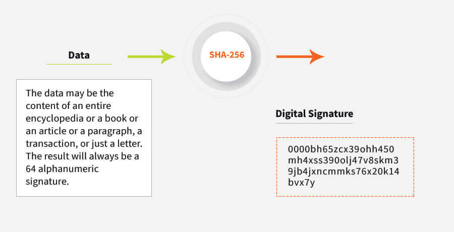
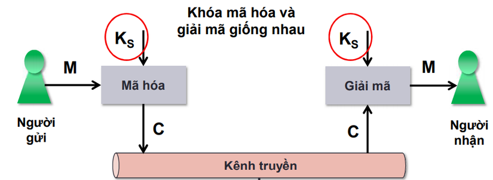
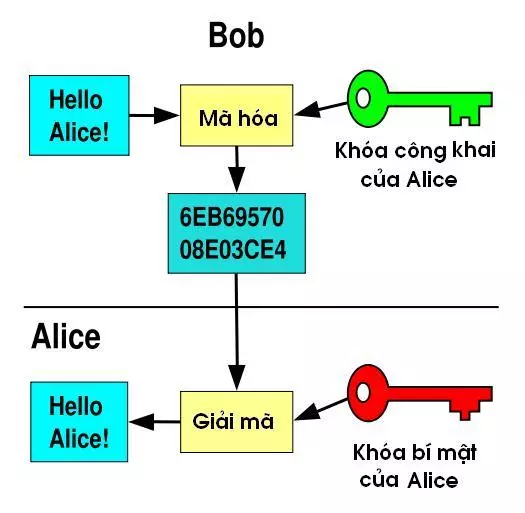
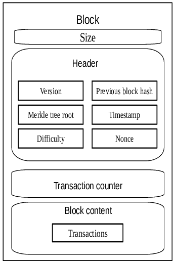

# 1. Trình bày về hashing function và SHA-256
 

> ## Hashing function
+ Hasing function là một phương pháp mã hóa thông tin bằng cách chuyển đổi dữ liệu đầu vào (input) thành một đoạn mã (hash code) độc lập và duy nhất với kích thước bất kỳ (like 32-bit or 64-bit or 128-bit or 256-bit ) và nó là hàm một chiều. Hash code được tính toán dựa trên các thuật toán mã hóa như MD5, SHA-1, SHA-2, SHA-3, v.v.
+ Trong blockchain, hàm băm (hashing function) được sử dụng để tạo ra một mã hash duy nhất cho mỗi khối (block) trong chuỗi (chain) của blockchain. Mã hash của khối hiện tại sẽ được sử dụng làm đầu vào cho khối tiếp theo, đảm bảo tính toàn vẹn của chuỗi blockchain.

 

###### Hashing Function

 

> ## SHA-256 (Secure Hash Algorithm 256-bit)
+ SHA-256 (Secure Hash Algorithm 256-bit) là một trong những thuật toán mã hóa phổ biến được sử dụng trong blockchain. Nó là một thuật toán hash mã hóa với kích thước đầu ra là 256 bit.
+ Tính chất:
    * Kích thước đầu vào không giới hạn: SHA-256 có thể băm một thông điệp đầu vào có kích thước bất kỳ.
    * Độ dài đầu ra cố định: Độ dài đầu ra của SHA-256 luôn là 256 bit.
    * Không thể giải mã: Không thể tái tạo lại thông điệp đầu vào từ giá trị băm đầu ra.
    * Bất kỳ hai thông điệp nào khác nhau sẽ cho giá trị băm đầu ra khác nhau.
    * Tốc độ xử lý nhanh: SHA-256 có tốc độ xử lý nhanh và khả năng xử lý các thông điệp lớn.
    * Có thể chứng thực: SHA-256 có thể được sử dụng để chứng thực tính toàn vẹn của một thông điệp trong một hệ thống bảo mật.
    * An toàn bảo mật cao: Kể từ khi được giới thiệu vào năm 2001, SHA-256 vẫn chưa bị bẻ khóa và được coi là an toàn trong việc bảo vệ thông tin trên mạng.
+ Trong quá trình xây dựng blockchain, SHA-256 được sử dụng để bảo mật và xác thực thông tin. Ví dụ, khi một giao dịch mới được tạo ra, nó sẽ được đưa vào một khối mới và sử dụng SHA-256 để tạo ra một mã hash độc nhất cho khối này. Mã hash của khối mới này sẽ được lưu trữ trong khối trước đó, đảm bảo tính toàn vẹn của blockchain.

 

###### SHA-256 Algorithm

 

# 2. Trình bày về mã hóa đối xứng (symmetric cryptography) và mã hóa bất đối xứng (asymmetric cryptography)

Trong blockchain, mã hóa đối xứng **(symmetric cryptography)**  và mã hóa bất đối xứng **(asymmetric cryptography)** được sử dụng để bảo vệ tính toàn vẹn và bảo mật dữ liệu.

> ## Mã hóa đối xứng (symmetric cryptography)
+ Mã hóa đối xứng là một phương pháp mã hóa thông tin sử dụng cùng một khóa bí mật để mã hóa và giải mã dữ liệu. Trong mã hóa đối xứng, khóa bí mật là duy nhất và được sử dụng cho cả quá trình mã hóa và giải mã dữ liệu. Ví dụ về các thuật toán mã hóa đối xứng phổ biến bao gồm AES (Advanced Encryption Standard), DES (Data Encryption Standard), và 3DES (Triple DES).
+ Mã hóa đối xứng được sử dụng trong blockchain để bảo vệ dữ liệu và thông tin trong khối. Cụ thể, mã hóa đối xứng được sử dụng để mã hóa thông tin dữ liệu giao dịch trong các khối của blockchain, tránh cho bất kỳ ai không có quyền truy cập vào dữ liệu và thông tin này.
+ Ví dụ: Nếu Alice muốn gửi một tin nhắn cho Bob, cô ấy sẽ sử dụng một khóa bí mật để mã hóa tin nhắn trước khi gửi nó. Bob sẽ sử dụng cùng một khóa bí mật để giải mã tin nhắn và đọc nội dung của nó.
    Cụ thể về mã hóa AES như sau:
    - Alice muốn gửi một tin nhắn cho Bob: "Hello bob, Happy new year !"
    - Alice sử dụng khóa bí mật để mã hóa tin nhắn: "YH8zYflb34PZvyAJfZDbrV7Jn2Q+9V9xkxVKpBv7hQQ="
    - Alice gửi tin nhắn đã được mã hóa đến Bob.
    - Bob sử dụng cùng một khóa bí mật để giải mã tin nhắn và đọc nội dung của nó: "Hello bob, Happy new year !"

 

###### Symmetric Cryptography

 

> ## Mã hóa bất đối xứng (asymmetric cryptography)
+ Mã hóa bất đối xứng là một hệ thống mã hóa sử dụng hai khóa khác nhau: khóa bí mật (private key) và khóa công khai (public key). Khóa bí mật được giữ bí mật và sử dụng để giải mã thông tin, khóa công khai được chia sẻ công khai và được sử dụng để mã hóa thông tin.
+ Khóa bí mật còn được sử dụng để tạo chữ ký số trong quá trình xác thực danh tính của người sử dụng, khi người sử dụng tạo chữ ký số bằng khóa bí mật, thì chỉ có khóa công khai tương ứng mới có thể xác thực được chữ ký số đó. Trong khi đó, khóa công khai còn được sử dụng tạo chữ ký số dùng để xác thực danh tính của người gửi trong quá trình nhận thông tin, người nhận sử dụng khóa công khai của người gửi để xác thực chữ ký số của người gửi.
+ Khi một người dùng tạo ra một giao dịch mới trên blockchain, họ sẽ tạo chữ ký số (digital signature) bằng cách sử dụng khóa bí mật của mình. Chữ ký số này sẽ được gắn vào giao dịch và chuyển đi trên mạng blockchain cùng với thông tin giao dịch. 
+ Khi một nút trên mạng blockchain nhận được một giao dịch mới, nó sẽ sử dụng khóa công khai tương ứng với người dùng để giải mã chữ ký số. Nếu chữ ký số hợp lệ, tức là được tạo ra bởi người dùng đó sử dụng khóa bí mật của họ, thì giao dịch sẽ được xác thực và được thêm vào blockchain.
+ Ví dụ: Bob muốn gửi một tin nhắn cho Alice mà chỉ Alice mới có thể đọc được.
    - Bob sẽ sử dụng khóa công khai của Alice để mã hóa tin nhắn của mình, sau đó gửi tin nhắn đã được mã hóa cho Alice. Alice sẽ sử dụng khóa bí mật của mình để giải mã tin nhắn và đọc nội dung của nó.
    - Trong trường hợp này, khóa công khai của Alice được công khai cho mọi người để ai cũng có thể mã hóa tin nhắn và gửi cho Alice. Tuy nhiên, chỉ Alice mới có thể giải mã tin nhắn bằng khóa bí mật của mình. Điều này đảm bảo tính bảo mật của dữ liệu được gửi đi và chỉ có người nhận được cho phép mới có thể đọc được nội dung của nó.

###### Asymmetric Cryptography

# 3. Trình bày cấu trúc chung của một block

###### Blockchain Structure

 

> ## Block Size
+ BlockSize (kích thước khối) là một trong những thông số quan trọng trong mạng blockchain, đó là kích thước tối đa cho mỗi block trong chuỗi blockchain. BlockSize được định nghĩa bằng số byte hoặc kilobyte (KB).
+ BlockSize ảnh hưởng trực tiếp đến khả năng xử lý và thời gian xác nhận của giao dịch trong mạng blockchain. Với BlockSize nhỏ, mạng blockchain có thể xử lý ít giao dịch hơn một lúc, nhưng việc xác nhận các giao dịch này sẽ nhanh hơn. Tuy nhiên, với BlockSize lớn, mạng blockchain có thể xử lý nhiều giao dịch hơn một lúc, nhưng thời gian xác nhận các giao dịch có thể chậm hơn do thời gian cần thiết để khai thác và xác minh các khối lớn hơn.
+ Ngoài ra, BlockSize cũng ảnh hưởng đến chi phí của giao dịch trong mạng blockchain. Khi BlockSize nhỏ, các giao dịch có thể phải đợi cho đến khi có đủ dung lượng trống trong khối mới để được xử lý, và những giao dịch có phí thấp hơn có thể bị bỏ qua hoặc chậm xử lý. Tuy nhiên, với BlockSize lớn, các giao dịch có thể được xử lý nhanh hơn, nhưng cũng có thể yêu cầu phí giao dịch cao hơn để được đưa vào khối.
+ BlockSize thường được điều chỉnh để cân bằng giữa hiệu suất mạng blockchain và tính khả dụng của nó. Các mạng blockchain khác nhau có các kích thước khối khác nhau, ví dụ như Bitcoin có BlockSize tối đa là 1 MB, Ethereum có BlockSize tối đa là 15 KB.

> ## Block Header
+ Block Header là một phần quan trọng của mỗi khối trong chuỗi blockchain. Nó chứa các thông tin quan trọng để xác định tính hợp lệ của khối bao gồm các trường dữ liệu sau:
    - **Version**: Phiên bản của phần mềm được sử dụng để tạo ra khối. Đây là một số nguyên không dấu 32 bit.
    - **Timestamp**: Thời gian tạo khối, tính bằng giây kể từ Epoch (thời điểm 00:00:00 UTC ngày 1/1/1970). Đây là một số nguyên không dấu 32 bit.
    - **Merkle Root**: Merkle Root là một giá trị mã hóa duy nhất đại diện cho tất cả các giao dịch trong khối. Nó được tạo ra bằng cách sử dụng Merkle Tree, một cấu trúc dữ liệu nhị phân được sử dụng để kiểm tra tính toàn vẹn của các giao dịch trong khối. Merkle Root là một chuỗi hexa có độ dài 64 ký tự. Merkle Root được sử dụng để kiểm tra tính toàn vẹn của dữ liệu giao dịch trong khối. Nếu một giao dịch nào đó trong khối bị thay đổi, giá trị băm của nó sẽ thay đổi và dẫn đến thay đổi giá trị Merkle Root. Khi các nút trong mạng blockchain muốn kiểm tra tính toàn vẹn của khối được đề xuất, họ có thể so sánh giá trị Merkle Root được cung cấp trong Block Header với giá trị Merkle Root được tính toán từ các giá trị băm của các giao dịch trong khối. Nếu hai giá trị này giống nhau, khối được coi là hợp lệ và được chấp nhận bởi mạng.
    *Giải thích merkle tree :* 
        - Để tạo ra Merkle Root, ta sử dụng Merkle Tree. Đầu tiên, ta lấy tất cả các giao dịch trong khối và tạo ra các giá trị băm cho từng giao dịch bằng cách sử dụng một thuật toán băm như SHA-256. Sau đó, ta xếp các giá trị băm này theo thứ tự từ trái sang phải để tạo ra các lá của cây. Nếu số lượng lá không phải là số chẵn, ta sao chép lại giá trị băm cuối cùng để đảm bảo số lượng lá là số chẵn.
        - Tiếp theo, ta sử dụng các giá trị băm lá để tính toán các giá trị băm của các nút cha của cây. Mỗi nút cha được tính toán bằng cách lấy hai giá trị băm của các lá con gần nhất và tạo ra một giá trị băm mới bằng cách băm chúng cùng với nhau. Ta tiếp tục lặp lại quá trình này cho đến khi chỉ còn lại một giá trị băm duy nhất trên cấu trúc cây, gọi là Merkle Root.
    - **Nonce**: Một giá trị số nguyên không dấu ngẫu nhiên được sử dụng để thay đổi giá trị của khối (block) để đạt được một giá trị băm (hash) hợp lệ. Nonce thường được sử dụng trong quá trình khai thác (mining) các đồng tiền số như Bitcoin và Ethereum. Quá trình khai thác được thực hiện bằng cách giải quyết một bài toán tìm kiếm giá trị Nonce mà khi kết hợp với dữ liệu khối, sẽ cho ra một giá trị băm thỏa mãn yêu cầu về độ khó của mạng blockchain. Nonce thường được lặp đi lặp lại trong quá trình này cho đến khi đạt được giá trị băm mong muốn. Việc tìm kiếm giá trị Nonce phù hợp là một quá trình khó khăn, đòi hỏi tính toán và thời gian lớn, vì vậy khối (block) mới được thêm vào blockchain chỉ được tạo ra với một tốc độ rất chậm và đòi hỏi nhiều nguồn lực tính toán của các máy đào (miners). Tuy nhiên, quá trình khai thác với Nonce cũng đảm bảo tính toàn vẹn của dữ liệu trên blockchain và tránh được các hành vi gian lận.
    - **Previous Hash**: Trong blockchain, Previous Hash (Hash trước đó) là một giá trị băm của khối trước đó trong chuỗi blockchain. Đây là một chuỗi hexa có độ dài 64 ký tự. Nó được sử dụng để liên kết các khối (block) với nhau và tạo nên một chuỗi liên kết (blockchain). Mỗi khối trong blockchain sẽ chứa thông tin về Previous Hash của khối trước đó, thông qua trường dữ liệu này, các khối sẽ kết nối với nhau theo một trật tự cụ thể. Việc liên kết này giúp đảm bảo rằng mỗi khối chỉ có thể được thêm vào chuỗi blockchain nếu như nó được xác nhận là hợp lệ, được tạo ra bởi người khai thác có thẩm quyền và có được sự đồng thuận của mạng lưới. Nếu một khối bị thay đổi thông tin, giá trị băm của nó sẽ thay đổi và liên kết với khối trước đó cũng sẽ bị phá vỡ. Do đó, các khối được kết nối với nhau thông qua Previous Hash đảm bảo tính toàn vẹn của chuỗi blockchain, giúp tránh được các hành vi gian lận hoặc sửa đổi dữ liệu trên mạng lưới.
    - **Difficult Target**: Difficult target là độ khó của một mạng lưới blockchain để khai thác được một khối mới, được biểu diễn dưới dạng một giá trị số nguyên dương có độ dài 256-bit và được thiết lập bằng cách điều chỉnh các thông số trong mã nguồn blockchain. Việc đặt độ khó này là để đảm bảo tính toàn vẹn của blockchain bằng cách ngăn chặn việc khai thác quá nhanh hoặc quá chậm. Nếu độ khó quá thấp, người khai thác có thể khai thác quá nhanh, gây ra các vấn đề bảo mật và đe dọa tính toàn vẹn của blockchain. Ngược lại, nếu độ khó quá cao, quá trình khai thác khối mới sẽ trở nên quá khó khăn và dẫn đến sự chậm trễ trong giao dịch và hoạt động trên blockchain. Việc điều chỉnh độ khó được thực hiện dựa trên một số thông số như tốc độ khai thác hiện tại, tổng số lượng hash power, sức mạnh tính toán của các máy khai thác và các yếu tố khác tùy thuộc vào từng loại blockchain cụ thể. Khi điều chỉnh độ khó, các nhà phát triển và chuyên gia cố gắng tìm ra một giá trị phù hợp để đảm bảo tính toàn vẹn và an ninh của blockchain.
+ Tất cả các trường trên đều được sắp xếp và kết hợp với nhau theo một cách nhất định để tạo ra một chuỗi byte. Giá trị hash của khối được tính toán bằng cách sử dụng một thuật toán băm như SHA-256 hoặc SHA-3 trên chuỗi byte này. Giá trị hash của khối được lưu trữ trong trường "block hash" của khối và được sử dụng để xác minh tính hợp lệ của khối, đảm bảo tính toàn vẹn của chuỗi blockchain và ngăn chặn các hành vi gian lận.

> ## Transaction Counter

+ Trong mạng lưới blockchain, mỗi khối (block) bao gồm nhiều giao dịch (transaction) được thực hiện bởi các người dùng trên mạng. Transaction counter là một trường chỉ ra số lượng giao dịch có trong khối đó. Trường này là một số nguyên không dấu 32-bit và được mã hóa dưới dạng Little-endian.
+ Việc theo dõi transaction counter trong các khối là quan trọng để giám sát tốc độ xử lý và đảm bảo tính nhất quán của dữ liệu trên mạng lưới blockchain. Nếu số lượng giao dịch trong khối quá lớn, việc xử lý và truyền tải khối đó sẽ mất nhiều thời gian và tài nguyên hơn. Tuy nhiên, nếu số lượng giao dịch trong khối quá ít, thì việc sử dụng tài nguyên để tạo khối sẽ không được tối ưu.

> ## Transaction Data

+ Transaction data là trường của khối (block) chứa thông tin dữ liệu (data) về các giao dịch (transation) được thực hiện trong chuỗi blockchain. Mỗi giao dịch trong mạng blockchain sẽ được đóng gói vào một khối và có thể bao gồm thông tin về:
    - Input: là thông tin về địa chỉ và số tiền Bitcoin được chuyển đi từ các giao dịch trước đó. Mỗi giao dịch mới sẽ sử dụng các đầu vào này để xác định số tiền Bitcoin có sẵn để chuyển đi.
   - Output: là thông tin về địa chỉ và số tiền Bitcoin được chuyển đến trong giao dịch hiện tại. Mỗi giao dịch mới sẽ tạo ra các đầu ra mới này để chuyển tiền đến các địa chỉ tương ứng.
    - ScriptSig: là mã ký hiệu được sử dụng để xác minh chữ ký số của người gửi giao dịch, đảm bảo rằng người gửi thực sự là chủ sở hữu của tiền.
    - ScriptPubKey: là mã ký hiệu được sử dụng để xác định địa chỉ Bitcoin của người nhận tiền trong giao dịch.
    - Locktime: là thời gian khoá (lock time) của giao dịch, có thể được sử dụng để xác định thời điểm nào mà giao dịch có thể được thực hiện hoặc không thể bị hoàn lại.
+ Tất cả các thành phần trên được mã hóa và kết hợp để tạo thành một đoạn mã hexa, gọi là transaction data (dữ liệu giao dịch), được lưu trữ trên mạng lưới blockchain. Các nút trên mạng lưới sẽ sử dụng transaction data này để xác định tính hợp lệ của mỗi giao dịch.

***

