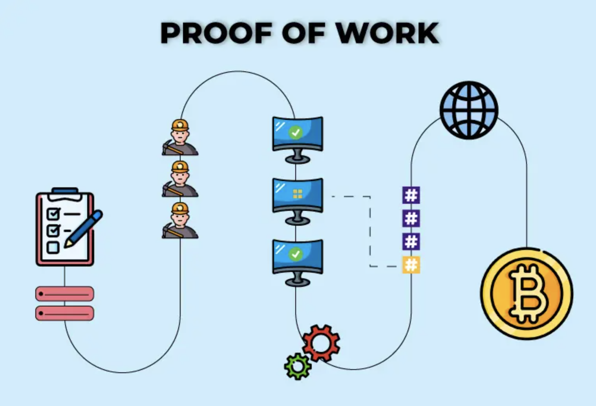
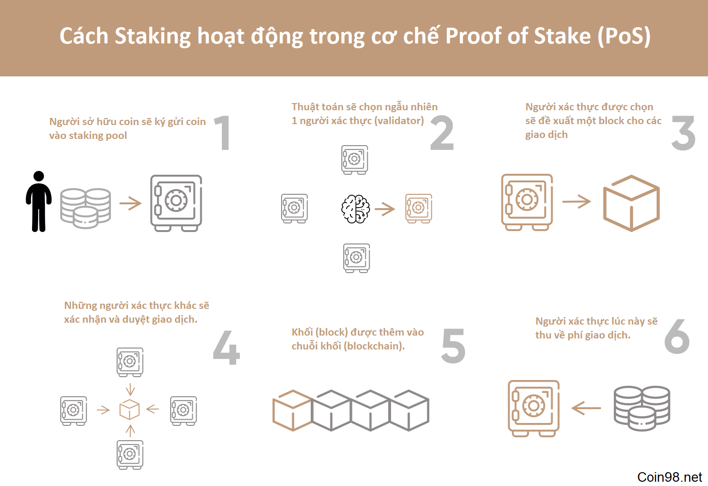
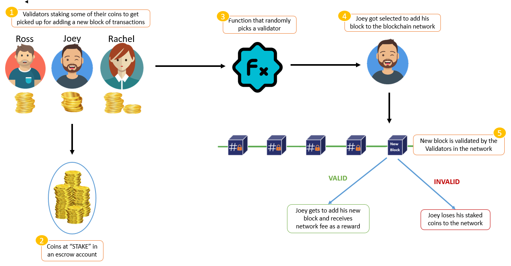
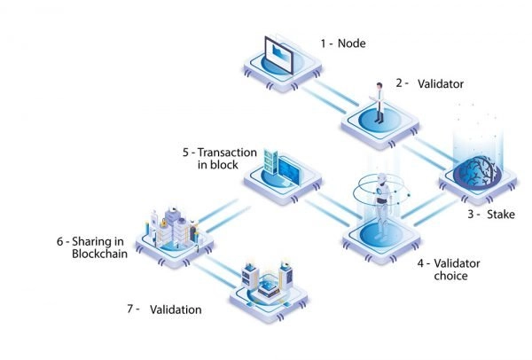

# What are POW, POS, DPOS, POA consensus mechanism in BlockChain?

> ## POW (Proof of Work)

###### Proof of Work

### `Khái niệm`
* Proof of Work (POW) là một cơ chế đồng thuận (consensus mechanism) trong blockchain, được sử dụng để đảm bảo rằng các nút trên mạng đồng thuận về sự thay đổi của blockchain. POW đòi hỏi các máy tính trong mạng blockchain phải giải một bài toán toán học phức tạp để đào được khối mới và xác nhận các giao dịch trên blockchain. Nó yêu cầu các máy tính trong mạng blockchain phải tìm ra giá trị hash của một khối mới sao cho giá trị hash này phải nhỏ hơn hoặc bằng một giá trị đích nhất định được xác định trước (difficulty target). Bài toán này được thiết kế để tốn nhiều thời gian và năng lượng để giải quyết, và chỉ có một cách để giải quyết là phải thử nghiệm nhiều lần, vì vậy nó được xem là cực kỳ khó khăn để xâm nhập hoặc tấn công.
* Các máy tính tham gia vào quá trình giải bài toán POW được gọi là miner và họ sẽ nhận được phần thưởng đào cho việc tìm ra giải pháp đúng cho bài toán. Khi một khối mới được tạo ra và được xác nhận bởi mạng POW, các giao dịch trong khối mới này sẽ được xác thực và ghi vào blockchain.

### `Cơ chế hoạt động`
* Khi một người dùng gửi một giao dịch trên blockchain, thì mạng sẽ phải xác nhận và chứng minh rằng giao dịch đó là hợp lệ và được chấp nhận trước khi thêm vào một khối mới trong blockchain. Và để làm được điều đó, hệ thống sẽ yêu cầu các nút mạng (nodes) phải giải quyết một bài toán toán học phức tạp được tạo ra bởi hàm POW.
* Nút mạng tham gia vào tính toán được gọi là thợ đào (miners), và quá trình giải toán gọi là đào (mining). Cần có cộng đồng thợ đào để thực hiện một lượng công việc khổng lồ để giải mỗi phép toán nối tiếp nhau.
* Để khai thác một khối mới trên blockchain, các thợ đào phải sử dụng sức mạnh tính toán của máy tính giải quyết một bài toán toán học phức tạp như tìm số nguyên dương nonce sao cho hàm băm (hash function) của nonce và dữ liệu khối (block data) là hash code có giá trị nhỏ hơn một ngưỡng cố định (difficulty target).
* Khi một node giải quyết được bài toán POW, nó sẽ thông báo cho các nút khác trên mạng và các nút khác sẽ xác minh kết quả đó. Nếu kết quả đúng, khối mới sẽ được thêm vào blockchain, và node đã giải quyết bài toán POW sẽ được thưởng bằng một số tiền định trước của đồng tiền kỹ thuật số (như Bitcoin) hoặc các token khác. Sau khi khối mới được thêm vào blockchain, các giao dịch trong khối đó sẽ được xác nhận và được thêm vào danh sách các giao dịch hợp lệ trên blockchain. Các node khác trên mạng sẽ cập nhật lại blockchain của mình để phản ánh sự thay đổi này.

### `Ưu điểm`
* Tính an toàn cao: POW là một cơ chế đồng thuận rất an toàn và được sử dụng trong nhiều blockchain lớn như Bitcoin và Ethereum. Cơ chế này đảm bảo rằng các giao dịch được xác nhận trên blockchain là chính xác và không bị thay đổi.
* Tính bảo mật cao: PoW là cách tốt nhất để duy trì sự bảo mật và đồng thuận trong mạng phi tập trung. Lý do là PoW đòi hỏi phí tài nguyên và phần cứng liên tục, thay vì một khoản phí để tham gia như PoS. Giá trị Bitcoin ngày càng tăng lên đã khuyến khích nhiều nhà khai thác tham gia vào mạng lưới, đồng thời tăng sức mạnh và tính bảo mật của nó.
* Tính khó tính toán: Thuật toán POW yêu cầu các nút trên mạng phải giải quyết một bài toán toán học phức tạp để tạo ra một khối mới trên blockchain. Quá trình giải quyết bài toán này yêu cầu nhiều sức mạnh tính toán và điện năng, làm cho việc tấn công blockchain thông qua POW rất khó khăn.
* Tính công bằng: POW là một cơ chế đồng thuận công bằng, nghĩa là tất cả các nút trên mạng đều có cơ hội giải quyết bài toán POW và nhận được phần thưởng tương ứng. Điều này đảm bảo rằng không ai có thể kiểm soát quá trình xác nhận giao dịch và tạo ra khối mới trên blockchain.
* Tính đồng nhất: POW đảm bảo tính đồng nhất của blockchain bằng cách yêu cầu tất cả các nút trên mạng phải đồng thuận về quá trình tạo ra khối mới trên blockchain. Nếu một nút trên mạng có ý định thay đổi lịch sử giao dịch của blockchain, nó sẽ phải giải quyết lại tất cả các bài toán POW từ đầu, điều này rất khó khăn và không thể thực hiện được.

### `Nhược điểm`
* Tốn kém: Việc tạo ra một khối mới trên blockchain thông qua POW yêu cầu sử dụng rất nhiều sức mạnh tính toán và điện năng, điều này làm tăng chi phí hoạt động và gây ra ảnh hưởng đến môi trường.
* Tốn thời gian: Người khai thác phải kiểm tra nhiều giá trị nonce để tìm ra giải pháp phù hợp cho câu đố phải giải để khai thác khối, đây là một quá trình tốn thời gian, do đó quá trình xác nhận giao dịch cũng chậm hơn so với các cơ chế đồng thuận khác.
* Giảm tính phi tập trung: Bởi vì phần thưởng chỉ dành cho các thợ đào đầu tiên và các thợ đào khác không có thu nhập nên các thợ đào có xu hướng kết hợp lại với nhau, tạo nên các mining pool để có thể có một sức mạnh đủ lớn để tới đích trước. Việc này sẽ tạo ra một hệ quả khi một mining pool quá lớn trên 50% tổng số máy đào thì việc xác minh giao dịch sẽ không còn phi tập trung nữa và có thể bị thao túng bởi chính mining pool đó gây ra tính không minh bạch cho mạng lưới.
* Rủi ro 51% : Nếu một thực thể sử dụng sức mạnh tính toán kiểm soát sở hữu 51% hoặc hơn 51% số nút trong mạng, thì thực thể đó có thể làm hỏng chuỗi khối bằng cách giành được phần lớn mạng.

> ## POS (Proof of Stake)

###### Proof of Stake

### `Khái niệm`
* Proof of Stake (POS) là một cơ chế đồng thuận thay thế cho Proof of Work trong blockchain dùng để xác thực và xác nhận giao dịch. Thay vì sử dụng sức mạnh tính toán để giải quyết các bài toán phức tạp để khai thác khối mới như POW, POS yêu cầu các node trong mạng đặt cược một số tiền tiền tệ kỹ thuật số nhất định của mình để đảm bảo tính đáng tin cậy của họ khi tham gia vào quá trình đồng thuận.
* Thuật toán lựa chọn này kết hợp số lượng cổ phần (số tiền điện tử) với các yếu tố khác như lựa chọn dựa trên tuổi của đồng xu, quy trình ngẫu nhiên để làm cho lựa chọn công bằng cho mọi người trên mạng.
    + Lựa chọn dựa trên tuổi tiền xu: Thuật toán theo dõi thời gian mỗi nút ứng cử viên trình xác thực vẫn là trình xác thực. Nút càng cũ thì cơ hội trở thành trình xác nhận mới càng cao.
    + Lựa chọn khối ngẫu nhiên: Trình xác nhận được chọn với sự kết hợp của 'giá trị băm thấp nhất' và 'cổ phần cao nhất'. Nút có sự kết hợp trọng số tốt nhất trong số này sẽ trở thành trình xác thực mới.

### `Cơ chế hoạt động`
+  Khi một giao dịch mới được thêm vào mạng, các staker trong hệ thống POS sẽ cạnh tranh với nhau để trở thành validator (người xác thực) của khối đó.
+ Các staker cạnh tranh nhau bằng cách đặt cược (stake) một số tiền cố định vào hệ thống (ký gửi coin vào staking pool) để tham gia vào quá trình đánh giá độ tin cậy và cạnh tranh trở thành validator. Nếu một staker vi phạm các quy tắc của hệ thống POS, ví dụ như thực hiện gian lận trong quá trình đánh giá, thì họ sẽ bị phạt bằng việc mất một phần hoặc toàn bộ số tiền đang ký gửi trong hệ thống. 
+ Hệ thống sẽ thực hiện việc chọn ngẫu nhiên một số staker để trở thành validator của khối đó, dựa trên mức độ đóng góp (như tuổi tiền xu) và số lượng tiền được đặt cược vào hệ thống của từng staker. Các staker có số tiền đặt cược lớn hơn sẽ có cơ hội cao hơn để được chọn trở thành validator.
+  Sau khi một staker được chọn làm validator cho khối mới, họ sẽ xác nhận giao dịch trong khối đó và tạo một chữ ký số cho khối mới. Sau đó, khối mới sẽ được broadcast (phát sóng) tới toàn bộ mạng và các staker khác sẽ xác thực chữ ký số của khối đó để đảm bảo tính toàn vẹn của khối và đồng thuận rằng khối mới được tạo ra chính xác. Sau khi khối mới được xác thực bởi đủ số lượng staker, nó sẽ được thêm vào chuỗi khối và trở thành phần của blockchain.
+ Sau khi validator đã xác thực khối mới và đóng góp vào mạng, họ sẽ nhận được phần thưởng cho việc tham gia vào quá trình đóng góp và giúp duy trì tính toàn vẹn của blockchain. Phần thưởng này thường được trả bằng đồng tiền của hệ thống blockchain đó. Ví dụ, trong Ethereum, validator sẽ nhận được đồng ETH làm phần thưởng.

### `Ưu điểm`
+ Tiết kiệm năng lượng: POS tiêu thụ ít năng lượng hơn so với POW vì không cần tính toán phức tạp và tiêu thụ điện năng lớn như trong POW.
+ Công bằng hơn: Với POS, tất cả các staker có cơ hội cạnh tranh trở thành validator, không chỉ những người có thể đầu tư vào phần cứng và điện năng đắt đỏ như trong POW.
+ Giảm nguy cơ tấn công 51%: Để tiến hành cuộc tấn công 51%, kẻ tấn công sẽ phải sở hữu 51% tổng số tiền điện tử trong mạng, điều này khá tốn kém. Điều này được coi là thực hiện cuộc tấn công quá tẻ nhạt, tốn kém và không mang lại nhiều lợi nhuận.
+ Khả năng mở rộng: POS cho phép các hệ thống blockchain mở rộng tốt hơn bằng cách tăng số lượng validator, mà không gặp những vấn đề về năng lượng và hiệu suất tính toán như trong POW.
+ An toàn và bảo mật: Một người cố gắng tấn công mạng sẽ phải sở hữu 51% cổ phần (rất tốn kém). Các staker trong hệ thống POS không cần phải trang bị phần cứng đắt tiền và thường không cần cài đặt phần mềm độc hại vào hệ thống, do đó giảm rủi ro bị hack và mất coin.

### `Nhược điểm`
+ Trình xác thực cổ phần lớn: Nếu một nhóm ứng cử viên trình xác thực kết hợp và sở hữu một phần đáng kể trong tổng số tiền điện tử, họ sẽ có nhiều cơ hội trở thành trình xác nhận hơn. Cơ hội tăng lên dẫn đến các lựa chọn tăng lên, dẫn đến việc kiếm được phần thưởng giả mạo ngày càng nhiều, dẫn đến việc sở hữu một phần tiền tệ khổng lồ. Điều này có thể khiến mạng trở nên tập trung theo thời gian (giảm tính phi tập trung của mạng).
+ Quy mô chưa lớn: Hệ thống PoS vẫn chưa mở rộng quy mô đến mức như Bitcoin hoặc Ethereum. Vì thế, chưa phi tập trung hoặc an toàn bằng các hệ thống PoW hàng đầu. Song, PoS có thể bắt kịp PoW nhờ khả năng mở rộng, rào cản gia nhập thấp hơn và không cần phần cứng chuyên dụng.
+ Nguy cơ chia tách mạng: POS có thể dẫn đến nguy cơ chia tách mạng nếu có nhiều phiên bản blockchain tồn tại. Nếu các validator không đồng ý với nhau, họ có thể tạo ra các phiên bản khác nhau của blockchain, dẫn đến sự không đồng bộ và mất tính toàn vẹn của mạng.

## So sánh POS và POW

Tính Chất | Proof of Work (PoW) | Proof of Stake (PoS)
|----------|-------------------------------|-------------------------|
Cơ chế hoạt động | Xác suất khai thác một khối được xác định bởi sức mạnh tính toán của máy tính người khai thác để giải quyết bài toán phức tạp. | Xác suất xác thực một khối mới được xác định bởi số tiền cổ phần mà một người nắm giữ (số tiền họ sở hữu).
Tài nguyên sử dụng | Cần công cụ khai thác mạnh như máy tính cấu hình cao và đặc biệt cần nhiều năng lượng điện năng để hoạt động | Tiêu thụ rất ít điện năng nhưng để xác suất trở thành validator cao thì cần nhiều tiền đặt cược
An toàn và bảo mật | Tin tặc sẽ cần phải có 51% sức mạnh tính toán để thêm khối độc hại, điều này rất tốn kém. | Tin tặc sẽ cần sở hữu 51% tổng số tiền điện tử trên mạng, điều này thực tế là không thể.
Độ phân tán | Được phân tán rộng rãi giữa các thợ đào | Không được phân tán rộng rãi như PoW, các thợ đào lớn hơn có nhiều quyền lực hơn
Sự phân cấp	| Không có phân cấp tất cả người dùng đều có thể đào được | Có sự phân cấp, các thợ đào lớn hơn có khả năng nhận được nhiều hơn so với các thợ đào nhỏ hơn
Hiệu quả | Tốn nhiều thời gian và điện năng, thiết bị phần cứng để giải quyết bài toán | PoS thường nhanh hơn PoW vì không cần giải quyết bài toán phức tạp để xác nhận giao dịch
 

> ## DPoS (Delegated Proof of Stake)

###### Delegated Proof of Stake

### `Khái niệm`
+ Delegated Proof of Stake (DPoS) là một thuật toán đồng thuận được sử dụng trong blockchain để giải quyết vấn đề độ tin cậy và hiệu suất mà các thuật toán truyền thống khác không đáp ứng được.
+ Thuật toán DPoS phát triển từ Proof of Stake (POS), nhưng khác với POS, nó yêu cầu người dùng sở hữu token của blockchain để bỏ phiếu cho một số người đại diện được ủy quyền để đóng góp vào việc xác minh giao dịch và tạo khối. Những người được ủy quyền này được gọi là "witnesses" hoặc "delegates".

### `Cơ chế hoạt động`
+ Khi một giao dịch được gửi đến mạng blockchain, nó sẽ được truyền đến các nút mạng trong hệ thống. Sau đó, các witnesses hoặc delegates được ủy quyền sẽ xác minh và chứng minh tính hợp lệ của giao dịch đó. Các witnesses hoặc delegates này được chọn bởi cộng đồng sử dụng blockchain thông qua việc bỏ phiếu hoặc bằng cách sử dụng một hệ thống đại diện bao gồm một số lượng nhỏ các đại diện đáng tin cậy.
+ Sau khi giao dịch được xác nhận là hợp lệ, các witnesses hoặc delegates sẽ đóng vai trò trong việc tạo ra khối mới cho blockchain. Để làm điều này, các witnesses hoặc delegates sẽ thực hiện một số tính toán phức tạp để tìm ra một khối mới phù hợp với yêu cầu của mạng.
+ Khi khối mới được tạo ra, các witnesses hoặc delegates sẽ chèn các giao dịch mới vào khối và xác nhận chúng. Sau đó, khối mới này sẽ được truyền đến tất cả các nút trong mạng để được xác nhận. Sau khi xác nhận hoàn tất, phần thưởng sẽ được chia sẻ với những người bỏ phiếu cho witnesses hoặc delegates.

### `Ưu điểm`
+ Tốc độ xử lý nhanh: DPoS được thiết kế để tối ưu hóa tốc độ xử lý giao dịch trên blockchain, giúp nhanh chóng xác minh và xác nhận giao dịch trên blockchai nhờ vào việc  làm giảm đáng kể số lượng các node tham gia xác minh tính hợp lệ của giao dịch.
+ Tiết kiệm năng lượng: DPoS tiết kiệm năng lượng hơn so với Proof of Work (PoW) vì nó không đòi hỏi các nút mạng phải giải quyết bài toán phức tạp để tạo khối mới.
+ Điều khiển bởi cộng đồng: DPoS cho phép cộng đồng blockchain có quyền ủy quyền và kiểm soát các nhân sự quản lý blockchain. Điều này giúp tăng tính minh bạch và đảm bảo rằng quyền lực không tập trung vào một số người dùng.
+ Khả năng mở rộng dễ dàng: DPoS dễ dàng mở rộng và có thể thích ứng với sự tăng trưởng của blockchain, do cộng đồng có khả năng thay đổi số lượng các witnesses theo nhu cầu.

### `Nhược điểm`
+ Độ tin cậy thấp hơn so với PoW: DPoS yêu cầu phải tin tưởng vào các witnesses được ủy quyền để xác minh giao dịch trên blockchain. Nếu các witnesses này không chính trực hoặc bị tấn công, tính an toàn của blockchain có thể bị đe dọa.
+ Nguy cơ bị tấn công 51%: DPoS cũng có nguy cơ bị tấn công 51% giống như PoW và PoS, trong trường hợp một cá nhân hoặc một nhóm nhỏ người sở hữu quá nhiều phần trăm lực lượng bỏ phiếu trong mạng lưới.
 

> ## POA (Proof of Authority)

###### Proof of Authority

### `Khái niệm`
+ Proof of Authority (POA) là một cơ chế đồng thuận trong blockchain, trong đó việc xác nhận các giao dịch mới được thực hiện bởi các validator được chọn trước. Trong POA, các validator được xác định dựa trên danh sách được phê duyệt bởi các chủ sở hữu của blockchain. Các validator này sẽ đảm bảo việc xác nhận giao dịch và tạo khối mới trên blockchain. Các validator trong POA cũng không cần phải tiêu tốn năng lượng để giải quyết các bài toán tính toán phức tạp như trong các cơ chế đồng thuận Proof of Work (POW) hoặc Proof of Stake (POS).
+ Những điều kiện để được chọn làm validator trong POA:
    * Được chấp thuận bởi các validator hiện tại: Người dùng cần đăng ký xin trở thành validator trên mạng POA và cung cấp danh tính chính thức của họ được công nhận trong cuộc sống thực, các validator hiện tại sẽ xem xét yêu cầu và thực hiện quy trình thông qua hệ thống POA Governance để quyết định xem liệu người dùng đó có đáp ứng được các yêu cầu và có thể trở thành validator hay không.
    * Có đủ khả năng kỹ thuật: Người dùng cần có đủ kiến thức kỹ thuật để triển khai và quản lý một node POA. Họ cũng cần có kinh nghiệm về xử lý các sự cố và bảo mật để đảm bảo tính ổn định và an toàn của hệ thống.
    * Có tài sản thế chấp: Người dùng cần có một số tài sản thế chấp (thường là token POA) để đảm bảo tính trung thực và trách nhiệm của họ trong việc xác thực các giao dịch trên blockchain. Số lượng tài sản thế chấp yêu cầu có thể khác nhau tùy thuộc vào quy định của mỗi địa điểm sử dụng POA.
    * Không có lịch sử gian lận hoặc sai phạm: Người dùng không được có bất kỳ lịch sử gian lận hoặc sai phạm trong hoạt động trên blockchain. Nếu có bất kỳ hành vi này, người dùng sẽ bị loại khỏi danh sách validator.
    * Tuân thủ các quy định và quy tắc: Người dùng cần phải tuân thủ các quy định và quy tắc của hệ thống POA, bao gồm cả việc thực hiện các nhiệm vụ liên quan đến bảo mật, quản lý và phát triển của hệ thống.
+ POA là một cơ chế đồng thuận đơn giản và hiệu quả trong việc xác minh giao dịch và tạo khối mới. Tuy nhiên, POA có nhược điểm là không phải là một cơ chế đồng thuận phân tán và có thể dễ dàng bị tấn công nếu các validator bị chiếm đoạt hoặc bị tấn công bởi hacker.

### `Cơ chế hoạt động`
+ Chọn validator: Đầu tiên, các thành viên của mạng blockchain sẽ chọn một số node để làm validator trong mạng. Các validator này sẽ đảm nhận việc xác minh các giao dịch trên blockchain và tạo các khối mới.
+ Xác minh giao dịch: Khi một giao dịch được gửi đến mạng, các validator sẽ xác minh tính hợp lệ của giao dịch và chứng minh rằng họ là những người được ủy quyền để thực hiện việc xác minh này.
+ Tạo khối: Sau khi các giao dịch được xác minh, các validator sẽ đồng ý với nhau để tạo một khối mới và đưa giao dịch đã được xác minh vào khối đó.
+ Thưởng và phạt: Các validator sẽ được thưởng cho việc tham gia vào việc xác minh giao dịch và tạo khối mới. Tuy nhiên, nếu các validator không thực hiện nhiệm vụ của mình một cách đáng tin cậy, họ có thể bị phạt bằng cách mất phần thưởng hoặc bị loại khỏi mạng.

### `Ưu điểm`
+ Tốc độ xử lý giao dịch nhanh: Vì POA sử dụng các validator được ủy quyền thay vì sử dụng các thuật toán phức tạp như Proof of Work hay Proof of Stake, việc xác nhận giao dịch trên blockchain được thực hiện nhanh chóng hơn. Do đó, POA được sử dụng rộng rãi trong các ứng dụng đòi hỏi tốc độ xử lý cao.
+ Tính trung thực và an toàn: Với POA, các validator được ủy quyền đã được kiểm tra kỹ lưỡng và phải tuân thủ các quy tắc, mỗi người được ủy quyền để trở thành validator của toàn bộ quá trình đều hiển thị danh tính của mình cho mọi người. Vì vậy danh tính này sẽ bị tổn hại cả ở cấp độ kỹ thuật số (trong mạng Blockchain) và ở cấp độ đời thực validator này cố gắng lừa gạt hệ thống, vì nó là vĩnh viễn trong Blockchain.
+ Tiết kiệm năng lượng và chi phí: POA tiêu thụ ít năng lượng hơn so với Proof of Work vì không cần sử dụng các thuật toán tính toán phức tạp. Ngoài ra, việc sử dụng các validator ủy quyền cũng giúp giảm thiểu chi phí phát sinh trong quá trình đồng thuận và xác thực các giao dịch.

### `Nhược điểm`
+ Thiếu tính phi tập trung: Vì chỉ có một nhóm validator được ủy quyền để xác nhận các giao dịch trên blockchain, POA không đảm bảo tính phi tập trung của hệ thống như các cơ chế đồng thuận khác.
+ Nguy cơ thao túng hệ thống: Một vấn đề quan trọng phổ biến khác là mọi người đều có quyền truy cập vào danh tính của người xác thực PoA. Tuy nhiên, việc biết danh tính của người xác thực có thể cho phép các bên thứ ba thao túng hệ thống.

***

